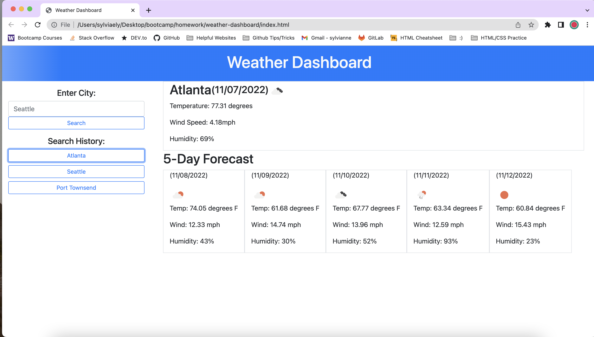

# Weather Dashboard

## Description
This application has a form input that captures the name of a city entered by a user.  It takes the value entered by users and uses the OpenWeather API to retrieve data about the entered city's weather.  If the city entered doesn't exist, the user is alerted to enter a correct city name.  If the city does exist, the application then prints out the city's current weather as well as the five day forecast.  It then stores the city name in local storage and also prints out the stored city name below the search bar so a user can click on it again and have that city's weather information reload on the page.  

## Installation
NA

## Usage
This application is built with travelers in mind so that they can quickly look up their destinations and plan a trip accordingly.  Their past lookups are stored locally so that travelers can easily click on their destinations to find weather information.

## Credits
NA

## License

Please refer to the LICENSE in the repo.

## Screenshots

## Link to Deployed Website
[Link](https://sely1724.github.io/weather-dashboard/)